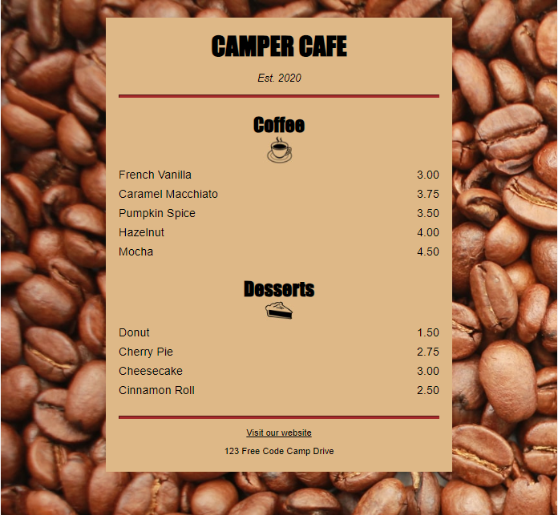

# Building a Cafe Menu

CSS tells the browser how to display your webpage. You can use CSS to set the color, font, size, and other aspects of HTML elements.

In this course, you'll learn CSS by designing a menu page for a cafe webpage.

