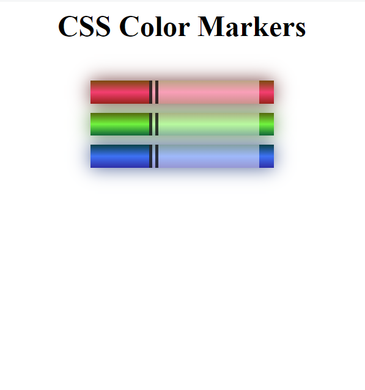

# Building a Set of Colored Markers

Selecting the correct colors for your webpage can greatly improve the aesthetic appeal to your readers.

In this course, you'll build a set of colored markers. You'll learn different ways to set color values and how to pair colors with each other.

