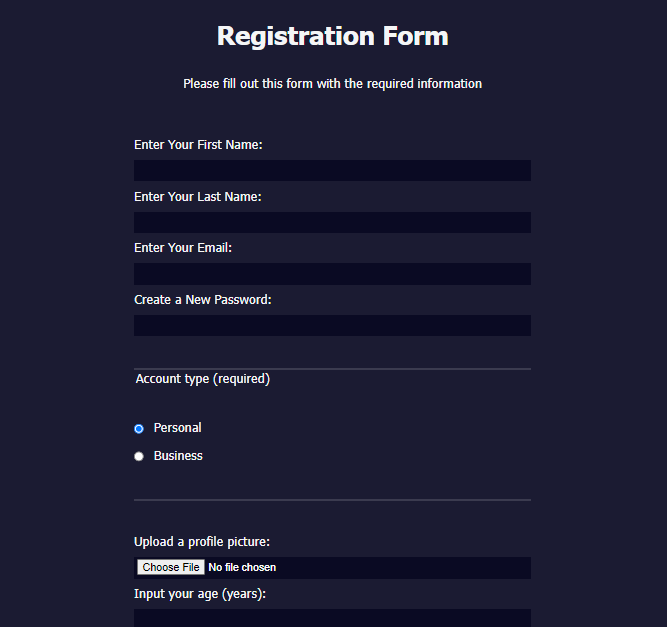

# Building a Registration Form

You can use HTML forms to collect information from people who visit your webpage.

In this course, you'll learn HTML forms by building a signup page. You'll learn how to control what types of data people can type into your form, and some new CSS tools for styling your page.

