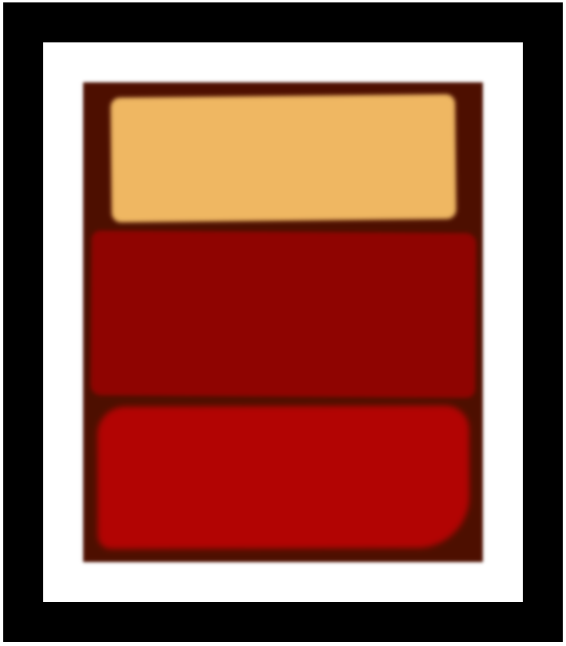

# Building a Rothko Painting

Every HTML element is its own box – with its own spacing and a border. This is called the Box Model.

In this course, we'll use CSS and the Box Model to create our own Rothko-style rectangular art pieces.

Final Output
