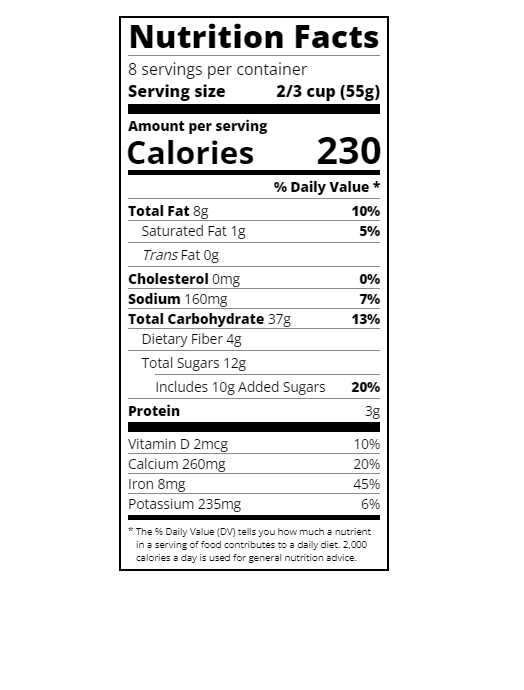

# Building a Nutrition Label

Typography is the art of styling our text to be easily readable and suit its purpose.

In this course, we'll use typography to build a nutrition label webpage. we'll learn how to style text, adjust line height, and position your text using CSS.

